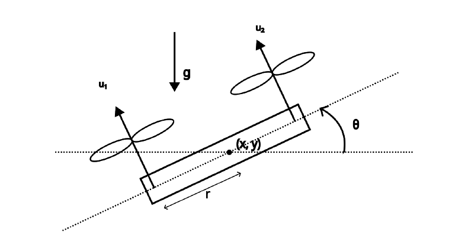

# Planar Quadrotor 

## Project Overview
We are using an Extended Kalman Filter (EKF) to estimate the state of a 2D quadrotor using noisy sensor measurements. The EKF combines physics-based predictions with real sensor data to provide accurate state estimates.

## Linear State-Space Equations Formulation 

### The Challenge
- Sensors are noisy: IMU and altitude sensors provide unreliable, jittery measurements
- Physics is complex: Real quadrotor dynamics are nonlinear and complicated  
- Solution: Combine sensor data with mathematical models to get better estimates than either could provide alone

### Nonlinear System Equations
The quadrotor's movement is described by these nonlinear equations:

$$
\begin{aligned}
m\ddot{x} &= -(u_1 + u_2)\sin\theta \\
m\ddot{y} &= (u_1 + u_2)\cos\theta - mg \\
I\ddot{\theta} &= r(u_1 - u_2)
\end{aligned}
$$

Where:
- m: mass of the quadrotor
- I: moment of inertia  
- r: distance from center to rotors
- g: gravitational acceleration
- u₁, u₂: rotor thrust forces

### Linearization Process
We linearize the system by computing Jacobian matrices - taking partial derivatives of each equation with respect to all state variables and control inputs. This creates a linear approximation of the system dynamics that can be used for state estimation.

$$
x_k = F x_{k-1} + B_k u_k + w_k
$$

- $$B_k = B_s \Delta t$$
- $$W_k$$ ,Is process noise. This comes from imperfect physics modeling, eg, Unmodeled aerodynamics, Parameter uncertainties.

### State-Space Representation
The IMU measures total acceleration including gravity, so we explicitly subtract $g$ when processing the $\ddot{y}$ measurement. The standard linearized system of state-space equations:

$$
\begin{aligned}
\dot{\mathbf{x}} &= A\mathbf{x} + B_s\mathbf{u} + G \\
\mathbf{y} &= C\mathbf{x} + D\mathbf{u}
\end{aligned}
$$

### System Definitions

### State Vector (6 elements)
$$
\mathbf{x} = 
\begin{bmatrix}
x \\
\dot{x} \\
y \\
\dot{y} \\
\theta \\
\dot{\theta}
\end{bmatrix}
$$

### Input Vector (2 elements) 
$$
\mathbf{u} = 
\begin{bmatrix}
u_1 \\
u_2
\end{bmatrix}
$$

### Observation Vector (3 elements)
Normally, an IMU provides linear accelerations and angular velocities in the body frame, which would require coordinate transformations. However, to simplify our observation model, we assume we can directly measure:

- Vertical position $$y$$ from an altitude sensor
- Pitch angle $$\theta$$ from the IMU  
- Angular velocity $$\dot{\theta}$$ from the IMU gyroscope

This allows us to use a simpler observation equation $$y_k = H x_k + v_k$$ where the measurements directly correspond to state variables.

$$
\mathbf{y} = 
\begin{bmatrix}
y \\
\theta \\
\dot{\theta} \\
\end{bmatrix}
$$

$$
y_k = H x_k + v_k
$$

 - $$v_k$$ is measurement noise (sensor errors, inaccuracies)

### Linearized System Matrices

* **A Matrix - System Dynamics (6×6):**

$$
A = \begin{bmatrix}
0 & 1 & 0 & 0 & 0 & 0 \\
0 & 0 & 0 & 0 & \frac{-cos(θ)(u₁+u₂)}{m} & 0 \\
0 & 0 & 0 & 1 & 0 & 0 \\
0 & 0 & 0 & 0 & \frac{-sin(θ)(u₁+u₂)}{m} & 0 \\
0 & 0 & 0 & 0 & 0 & 1 \\
0 & 0 & 0 & 0 & 0 & 0
\end{bmatrix}
$$
* **B Matrix - Control Input (6×2):**

$$
B = \begin{bmatrix}
0 & 0 \\
\frac{-sin(θ)}{m} & \frac{-sin(θ)}{m} \\
0 & 0 \\
\frac{cos(θ)}{m} & \frac{cos(θ)}{m} \\
0 & 0 \\
\frac{r}{I} & \frac{-r}{I}
\end{bmatrix}
$$

* **C Matrix - Measurement (3×6):**

$$
C = \begin{bmatrix}
0 & 0 & 1 & 0 & 0 & 0 \\
0 & 0 & 0 & 0 & 1 & 0 \\
0 & 0 & 0 & 0 & 0 & 1
\end{bmatrix}
$$

$$H = C$$ is the observation matrix that tells us which states we can directly measure with our sensors.

* **D Matrix  (3×2):**

$$
D = \begin{bmatrix}
0 & 0 \\
0 & 0 \\
0 & 0
\end{bmatrix}
$$

- $$\mathbf{D} = 0_{m \times n}$$ , because control inputs don't directly appear in sensor readings.
The sensors only measure the drone's actual state, not the commands you're sending
### F and H matrices

$$F = I + A \Delta t$$, where I symbolizes the old state and A symbolizes the change of it.

$$
F = \begin{bmatrix} 
1 & \Delta t & 0 & 0 & 0 & 0 \\
0 & 1 & 0 & 0 & \frac{-cos(θ)(u₁+u₂)}{m} \Delta t & 0 \\
0 & 0 & 1 & \Delta t & 0 & 0 \\
0 & 0 & 0 & 1 & \frac{-sin(θ)(u₁+u₂)}{m} \Delta t & 0 \\
0 & 0 & 0 & 0 & 1 & \Delta t \\
0 & 0 & 0 & 0 & 0 & 1 \\
\end{bmatrix}
$$

### Constant Terms

* **Gravity vector $G$:**  

$$
G = \begin{bmatrix}
0 \\
0 \\
0 \\
-g \\
0 \\
0
\end{bmatrix}
$$

### Key Linearization Results

**Partial derivatives:**  
- $\frac{\partial \ddot{x}}{\partial \theta} = -\frac{\cos\theta}{m}(u_1 + u_2)$
  
- $\frac{\partial \ddot{y}}{\partial \theta} = -\frac{\sin\theta}{m}(u_1 + u_2)$
  
- $\frac{\partial \ddot{x}}{\partial u_1} = -\frac{\sin\theta}{m}$, $\frac{\partial \ddot{x}}{\partial u_2} = -\frac{\sin\theta}{m}$
  
  
- $\frac{\partial \ddot{y}}{\partial u_1} = \frac{\cos\theta}{m}$, $\frac{\partial \ddot{y}}{\partial u_2} = \frac{\cos\theta}{m}$

- $\frac{\partial \ddot{\theta}}{\partial u_1} = \frac{r}{I}$, $\frac{\partial \ddot{\theta}}{\partial u_2} = -\frac{r}{I}$

## Extended Kalman Filter
### Formulas and Definitions
**Step 0: Initialization**

Kalman filter needs some initial data to begin working. We need:
- Initial conditions vector: $\ x̂_0$
- Initial variance matrix: $\ P_0 = I $
- Process noise variance matrix: $\ Q = 10^{-3}I $
- Measurement noise variance matrix: R = I (for now)

**Step 1: Prediction**

Here we predict the state of the system and calculate the estimated variance matrix:

- $\ x̂_i^- = Fx̂_{i-1} $
- $\ P_{i}^- = FP_{i-1}F^T + Q $ 

**Step 2: Correction**

We have to calculate gain coefficient, which defines our trust of the new measurement; our state estimate at the new step; and an update ot the variance matrix:

- $\ k_i = P_i^-(P_{i-1} + R)^{-1} $
- $\ x̂_i = (I-k_i)x̂^-_i + k_iz_i $
- $\ P_i = (I - k_i)P^-_{i} $

**Step 3: Iteration**

This step is just a technicality for updating current state and variance matrix of the system:

- $\ x̂_{i-1}^- = x̂_{i} $
- $\ P_{i-1} = P_i $
