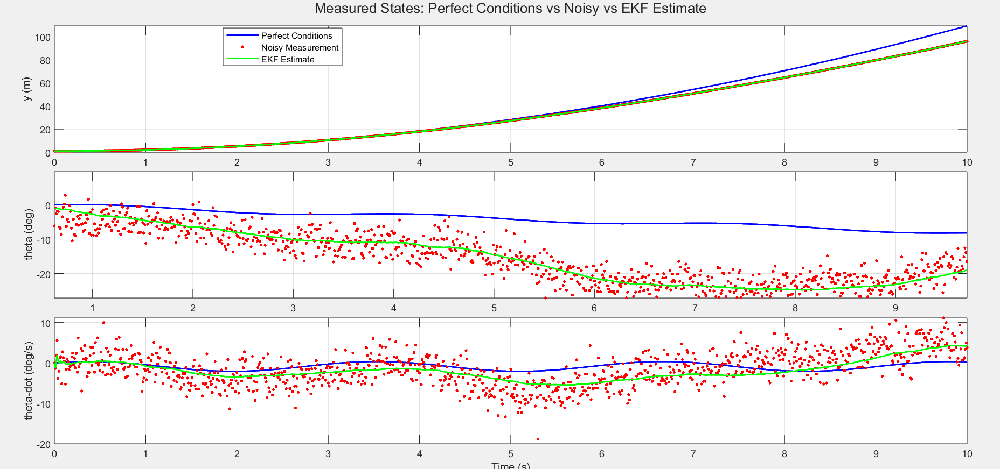
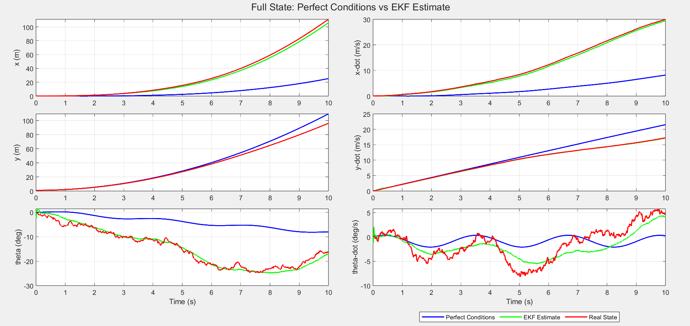

# Planar Quadrotor 

## Project Overview
We are using an Extended Kalman Filter (EKF) to estimate the state of a 2D quadrotor using noisy sensor measurements. The EKF combines physics-based predictions with real sensor data to provide accurate state estimates.


## Linear State-Space Equations Formulation 

### The Challenge
- Sensors are noisy: IMU and altitude sensors provide unreliable, jittery measurements
- Physics is complex: Real quadrotor dynamics are nonlinear and complicated  
- Solution: Combine sensor data with mathematical models to get better estimates than either could provide alone

### Nonlinear System Equations
The quadrotor's movement is described by these nonlinear equations:

$$
\begin{aligned}
m\ddot{x} &= -(u_1 + u_2)\sin\theta \\
m\ddot{y} &= (u_1 + u_2)\cos\theta - mg \\
I\ddot{\theta} &= r(u_1 - u_2)
\end{aligned}
$$

Where:
- m: mass of the quadrotor
- I: moment of inertia  
- r: distance from center to rotors
- g: gravitational acceleration
- u₁, u₂: rotor thrust forces

### Linearization Process
We linearize the system by computing Jacobian matrices - taking partial derivatives of each equation with respect to all state variables and control inputs. This creates a linear approximation of the system dynamics that can be used for state estimation.

$$
x_k = F x_{k-1} + B_k u_k + w_k
$$

- $$B_k = B_s \Delta t$$
- $$W_k$$ ,Is process noise. This comes from imperfect physics modeling, eg, Unmodeled aerodynamics, Parameter uncertainties.

### State-Space Representation
The IMU measures total acceleration including gravity, so we explicitly subtract $g$ when processing the $\ddot{y}$ measurement. The standard linearized system of state-space equations:

$$
\begin{aligned}
\dot{\mathbf{x}} &= A\mathbf{x} + B_s\mathbf{u} + G \\
\mathbf{y} &= C\mathbf{x} + D\mathbf{u}
\end{aligned}
$$


### System Definitions

### State Vector (6 elements)
$$
\mathbf{x} = 
\begin{bmatrix}
x \\
\dot{x} \\
y \\
\dot{y} \\
\theta \\
\dot{\theta}
\end{bmatrix}
$$

### Input Vector (2 elements) 
$$
\mathbf{u} = 
\begin{bmatrix}
u_1 \\
u_2
\end{bmatrix}
$$

### Observation Vector (3 elements)
Normally, an IMU provides linear accelerations and angular velocities in the body frame, which would require coordinate transformations. However, to simplify our observation model, we assume we can directly measure:

- Vertical position $$y$$ from an altitude sensor
- Pitch angle $$\theta$$ from the IMU  
- Angular velocity $$\dot{\theta}$$ from the IMU gyroscope

This allows us to use a simpler observation equation $$y_k = H x_k + v_k$$ where the measurements directly correspond to state variables.

$$
\mathbf{y} = 
\begin{bmatrix}
y \\
\theta \\
\dot{\theta} \\
\end{bmatrix}
$$

$$
y_k = H x_k + v_k
$$

 - $$v_k$$ is measurement noise (sensor errors, inaccuracies)


#### Linearized Continuous-Time Matrices
By taking partial derivatives, we obtain the **Jacobian matrices**:

* **A Matrix - System Dynamics (6×6):**

$$
A = \begin{bmatrix}
0 & 1 & 0 & 0 & 0 & 0 \\
0 & 0 & 0 & 0 & \frac{-cos(θ)(u₁+u₂)}{m} & 0 \\
0 & 0 & 0 & 1 & 0 & 0 \\
0 & 0 & 0 & 0 & \frac{-sin(θ)(u₁+u₂)}{m} & 0 \\
0 & 0 & 0 & 0 & 0 & 1 \\
0 & 0 & 0 & 0 & 0 & 0
\end{bmatrix}
$$
* **B Matrix - Control Input (6×2):**

$$
B = \begin{bmatrix}
0 & 0 \\
\frac{-sin(θ)}{m} & \frac{-sin(θ)}{m} \\
0 & 0 \\
\frac{cos(θ)}{m} & \frac{cos(θ)}{m} \\
0 & 0 \\
\frac{r}{I} & \frac{-r}{I}
\end{bmatrix}
$$

* **C Matrix - Measurement (3×6):**

$$
C = \begin{bmatrix}
0 & 0 & 1 & 0 & 0 & 0 \\
0 & 0 & 0 & 0 & 1 & 0 \\
0 & 0 & 0 & 0 & 0 & 1
\end{bmatrix}
$$

* **D Matrix  (3×2):**

$$
D = \begin{bmatrix}
0 & 0 \\
0 & 0 \\
0 & 0
\end{bmatrix}
$$

- $$\mathbf{D} = 0_{m \times n}$$, because control inputs don't directly appear in sensor readings.
The sensors only measure the drone's actual state, not the commands you're sending

#### Discrete-Time EKF Matrices
For the discrete EKF update, we use:
- **State transition Jacobian**: $F = I + A \Delta t$
- **Measurement Jacobian**: $H = C$ (constant)

### F and H matrices

$$F = I + A \Delta t$$, where I symbolizes the old state and A symbolizes the change of it.

$$
F = \begin{bmatrix} 
1 & \Delta t & 0 & 0 & 0 & 0 \\
0 & 1 & 0 & 0 & \frac{-cos(θ)(u₁+u₂)}{m} \Delta t & 0 \\
0 & 0 & 1 & \Delta t & 0 & 0 \\
0 & 0 & 0 & 1 & \frac{-sin(θ)(u₁+u₂)}{m} \Delta t & 0 \\
0 & 0 & 0 & 0 & 1 & \Delta t \\
0 & 0 & 0 & 0 & 0 & 1 \\
\end{bmatrix}
$$

The H matrix is the same as the C matrix, since they tell us what we can measure with our sensors:

$$
H = \begin{bmatrix}
0 & 0 & 1 & 0 & 0 & 0 \\
0 & 0 & 0 & 0 & 1 & 0 \\
0 & 0 & 0 & 0 & 0 & 1
\end{bmatrix}
$$


### Noise Modeling
- **Process noise**: $\sigma = 0.004$ (applied to all state derivatives)
- **Measurement noise**: $\sigma = 0.05$ (on each sensor channel)

The simulation generates three trajectories:
- `state.clean`: Noise-free Perfect Conditons (nonlinear integration),
- `state.real`: "Real-world" with added process + sensor noise,
- `state.estimate`: EKF output (updated at every time step).


### Constant Terms

* **Gravity vector $G$:**  

$$
G = \begin{bmatrix}
0 \\
0 \\
0 \\
-g \\
0 \\
0
\end{bmatrix}
$$

### Key Linearization Results

**Partial derivatives:**  
- $\frac{\partial \ddot{x}}{\partial \theta} = -\frac{\cos\theta}{m}(u_1 + u_2)$
  
- $\frac{\partial \ddot{y}}{\partial \theta} = -\frac{\sin\theta}{m}(u_1 + u_2)$
  
- $\frac{\partial \ddot{x}}{\partial u_1} = -\frac{\sin\theta}{m}$, $\frac{\partial \ddot{x}}{\partial u_2} = -\frac{\sin\theta}{m}$
  
  
- $\frac{\partial \ddot{y}}{\partial u_1} = \frac{\cos\theta}{m}$, $\frac{\partial \ddot{y}}{\partial u_2} = \frac{\cos\theta}{m}$

- $\frac{\partial \ddot{\theta}}{\partial u_1} = \frac{r}{I}$, $\frac{\partial \ddot{\theta}}{\partial u_2} = -\frac{r}{I}$

## Extended Kalman Filter Design
The Extended Kalman Filter (EKF) is used because our quadrotor system is nonlinear—its motion depends on sine and cosine of the angle $$\theta$$, so we can’t use a standard (linear) Kalman filter. Instead, the EKF **linearizes the system at each time step** using the current best estimate, then applies the regular Kalman update equations.

Our implementation follows the standard **predict–correct cycle**, and everything runs **in real time inside the simulation loop**.
### Prediction Step
First, we predict the next state using the true nonlinear physics—not a linear approximation. In our code, this is done by computing:

```matlab
delta_x_estimate(2) = (-sin(theta_estimate)*(control_input(t,1)+control_input(t,2))/m) * dt;
delta_x_estimate(4) = (cos(theta_estimate)*(control_input(t,1)+control_input(t,2))/m - g) * dt;
```
This ensures the prediction respects the actual dynamics.

Then, we linearize the system around the current estimate to predict how uncertainty (covariance) evolves. We build the Jacobian `F` matrix like this:

```matlab
F = eye(6) + dt * [ ...
    0 1 0 0 0 0;
    0 0 0 0 -cos(theta_estimate)*(control_input(t,1)+control_input(t,2))/m 0;
    0 0 0 1 0 0;
    0 0 0 0 -sin(theta_estimate)*(control_input(t,1)+control_input(t,2))/m 0;
    0 0 0 0 0 1;
    0 0 0 0 0 0];
```
This `F` matrix changes every time step because it depends on the current angle (`theta_estimate`) and thrust (`control_input`). That's what makes it an *Extended* Kalman Filter.
We then predict error covariance:
```matlab
P_prediction = F * P * F' + Q;
```
Where `Q = eye(6)*1e-5` represents small process noise (we trust the physics model and EJ 😅).

### Correction step
Next, we correct the estimate using the latest noisy sensor data (`output.real`)
We compute the measurement residual—the difference between what the sensor says and what we predicted:
```matlab
measurement_residual = output.real(t,:)' - C * state.estimate(t,:)';
```
Then, we calculate the Kalman gain, which decides how much to trust the sensor vs. the prediction:
```matlab
S = C * P_prediction * C' + R;
K = P_prediction * C' / S;
```
Here,`R = eye(3)*1e-1` is larger than `Q`, meaning we trust the physics more than the sensors-which makes sense, since sensors are noisy.

Finally, we update the state and covariance:
```matlab
state.estimate(t,:) = state.estimate(t,:) + (K * measurement_residual)';
P = (eye(6) - K * C) * P_prediction;
```
This gives us a smoother, more accurate estimate than the raw sensor data.
  
## MATLAB Implementation Breakdown

The code we wrote is divided into three key parts:

### 1. Main Script (`Planar_Quadrotor.m`)
This file sets up the simulation environment and runs everything. It starts by defining physical parameters:
```matlab
m = 0.5;         % mass [kg] 
r = 0.15;        % distance from center to rotors [m]
I = 0.005;       % moment of inertia [kg*m^2]
g = 9.81;        % gravity [m/s^2]
dt = 0.01;       % time step [s] 
theta = 0;       % angle [rads]
u1 = 2.45;       % force [N]
u2 = 2.45;       % force [N]
```
It defines time-varying control inputs:
```matlab
CU1 = 3 + 0.001*cos(2*time);  
CU2 = 3 + 0.001*sin(2*time); 
```
These inputs create small oscillations around a thrust level slightly above hover, ensuring the quadrotor moves and tilts in a nontrivial way.

Noise levels are set based on realistic assumptions:
```matlab
noise_data.state_noise_amp = 0.004;   % process noise
noise_data.output_noise_amp = 0.05;   % sensor noise
```
Finally, it calls the core simulation function:
```matlab
[state, output, errors] = simulation_quadrotor(rotor_data, control_input, noise_data, time, x0);
```
and then generates the final plots:
```matlab
plot_quadrotor_results(time, state, output, rotor_data.C, errors);
```
### 2. Core Simulation (`simulation_quadrotor.m`)

This function runs three parallel simulations in one loop, time step by time step:
- Clean trajectory (`state.clean`)
  Uses the true nonlinear dynamics with no noise. This is the Perfect Conditons.
- Real-world trajectory (`state.real`)
  Adds process noise to the state update and measurement noise to the outputs:
  ```matlab
  state_noise = 0.004 * randn(1,6);
  output_noise = 0.05 * randn(1,3);
  ```
- EKF estimate (`state.estimate`)
  Runs the full EKF in real time:
  - Predicts the next state using the same nonlinear physics as the clean simulation.
  - Builds the Jacobian `F` matrix using the current estimated angle and thrust.
  - Uses noisy measurements (`output.real`) to correct the estimate.
  - Updates covariance with `Q = 1e-5*I` and `R = 1e-1*I`.

 ### 3. Plotting Function (`plot_quadrotor_results.m`)
Generates two figures showing Perfect Conditons, noisy measurements, and EFK estimates together for all measured states.

## Results & Visualization
### Figure 1: Measured States — Perfect Conditions vs Noisy vs EKF



> The EKF successfully smooths out the sensor noise while closely tracking the true trajectory. Even though the red dots jump around due to 0.05 measurement noise, the green line remains stable.


### Figure 2: Full State Estimation — Perfect Conditions vs EKF


> Even **unmeasured states** like horizontal position ($x$) and velocities ($\dot{x}, \dot{y}$) are reconstructed accurately. This is possible due to **dynamic coupling**: thrust affects both $y$ and $\theta$, which indirectly informs $x$-motion through $\sin\theta$ and $\cos\theta$ terms.

