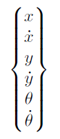
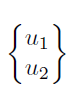
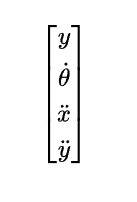

# Planar Quadrotor 
## Linearized State-Space Model

## Project Overview
We are using an Extended Kalman Filter (EKF) to estimate the state of a 2D quadrotor using noisy sensor measurements. The EKF combines physics-based predictions with real sensor data to provide accurate state estimates.
 

## The Challenge
- **Sensors are noisy**: IMU and altitude sensors provide unreliable, jittery measurements
- **Physics is complex**: Real quadrotor dynamics are nonlinear and complicated
- **Solution**: Combine sensor data with mathematical models to get better estimates than either could provide alone

## Nonlinear System Equations

The quadrotor's movement is described by these nonlinear equations:

$$
\begin{aligned}
m\ddot{x} &= -(u_1 + u_2)\sin\theta \\
m\ddot{y} &= (u_1 + u_2)\cos\theta - mg \\
I\ddot{\theta} &= r(u_1 - u_2)
\end{aligned}
$$

Where:
- $m$: mass of the quadrotor
- $I$: moment of inertia
- $r$: distance from center to rotors
- $g$: gravitational acceleration
- $u_1, u_2$: rotor thrust forces

## Linearization Process

We linearize the system around $\theta = 0$ (hover/near-level flight) because:
- The EKF requires linear system matrices
- $\theta = 0$ provides a stable operating point for linearization

The linearization is done by computing the Jacobian matrices - taking partial derivatives of each equation with respect to all state variables and control inputs.

## State-Space Representation

The standard state-space form is:

$$
\begin{aligned}
\dot{\mathbf{x}} &= A\mathbf{x} + B\mathbf{u} \\
\mathbf{y} &= C\mathbf{x} + D\mathbf{u}
\end{aligned}
$$

## System Definitions

### State Vector (6 elements)

### Input Vector (2 elements)

### Measurement Vector (4 elements - from IMU + Altitude Sensor)

## Linearized System Matrices

### A Matrix - System Dynamics ($6 \times 6$)
$$
A = \begin{bmatrix}
0 & 1 & 0 & 0 & 0 & 0 \\
0 & 0 & 0 & 0 & -\frac{u_1+u_2}{m} & 0 \\
0 & 0 & 0 & 1 & 0 & 0 \\
0 & 0 & 0 & 0 & 0 & 0 \\
0 & 0 & 0 & 0 & 0 & 1 \\
0 & 0 & 0 & 0 & 0 & 0
\end{bmatrix}
$$

### B Matrix - Control Input ($6 \times 2$)
$$
B = \begin{bmatrix}
0 & 0 \\
0 & 0 \\
0 & 0 \\
\frac{1}{m} & \frac{1}{m} \\
0 & 0 \\
\frac{r}{I} & -\frac{r}{I}
\end{bmatrix}
$$

### C Matrix - Measurement ($4 \times 6$)
$$
C = \begin{bmatrix}
0 & 0 & 1 & 0 & 0 & 0 \\
0 & 0 & 0 & 0 & 0 & 1 \\
0 & 0 & 0 & 0 & -\frac{u_1+u_2}{m} & 0 \\
0 & 0 & 0 & 0 & 0 & 0
\end{bmatrix}
$$

### D Matrix - D ($4 \times 2$)
$$
D = \begin{bmatrix}
0 & 0 \\
0 & 0 \\
0 & 0 \\
\frac{1}{m} & \frac{1}{m}
\end{bmatrix}
$$

## Key Linearization Results

**Partial derivatives at $\theta = 0$:**
- $\frac{\partial \ddot{x}}{\partial \theta} = -\frac{u_1 + u_2}{m}$ (Tilting creates horizontal acceleration)

- $\frac{\partial \ddot{y}}{\partial u_1} = \frac{1}{m}$, $\frac{\partial \ddot{y}}{\partial u_2} = \frac{1}{m}$ (Rotors create vertical acceleration)

- $\frac{\partial \ddot{\theta}}{\partial u_1} = \frac{r}{I}$, $\frac{\partial \ddot{\theta}}{\partial u_2} = -\frac{r}{I}$ (Differential thrust creates rotation)

## Gravity 

**Important**: Gravity (`g = 9.81 m/s²`) appears in the vertical acceleration equation and isnt ignored.

- **In the physics**: `ÿ = (u₁ + u₂)/m - g`
- **In implementation**: The `-g` term is handled as a constant offset in the vertical acceleration measurement
- The IMU measures total acceleration including gravity, so we explicitly subtract `g` when processing the `ÿ` measurement
